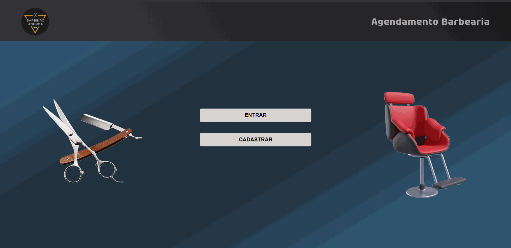

# Projeto Agendamento Barbearia 

    

Esse é um projeto de um site para agendamentos de serviços de uma barbearia, um site que possui diversas funcionalidades para o usuário utilizar. Foi desenvolvido e idealizado por mim

## Objetivo 🎯
O objetivo desse projeto foi demonstrar minhas habilidades com um projeto full-stack e buscar novos desafios, buscando aprender coisas novas.

## Principais Funcionalidades 🛠️
`Funcionalidade 1:` Sistema de login e cadastro 
`Funcionalidade 2:` consultar histórico de agendamento e opção de cancelamento 
`Funcionalidade 3:` Opção de agendamento. O agendamento consiste em escolher uma data, serviço, tipo de serviço e hora do agendamento desejada.

## Como acessar o site 💻
Para acessar é muito simples, basta clicar nesse link: <a target="_blank">https://agendamento-barbearia-production-24fa.up.railway.app</a>

## Documentação das rotas
Foi feita a documentação de todas as rotas do express e oque cada faz, a documetação foi feita com o swagger e pode ser acessado por aqui: https://agendamento-barbearia-production.up.railway.app/docs/

## Tecnologias utilizadas 👨‍💻

- HTML 

- CSS 

- JavaScript 

- NodeJS 

- PostgreSQL 

- Jquery 

- SCSS 

- Swagger 
