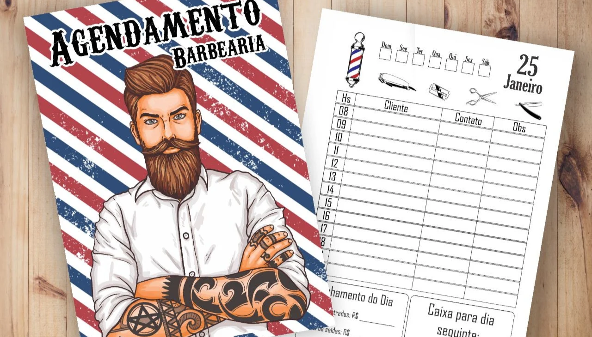

# Projeto Agendamento Barbearia 

Esse é um projeto de um site para agendamentos de serviços de uma barbearia, um site que possui diversas funcionalidades para o usuário utilizar. Foi desenvolvido e idealizado por mim

## Objetivo 🎯
O objetivo desse projeto foi demonstrar minhas habilidades com um projeto full-stack e buscar novos desafios, buscando aprender coisas novas.

## Principais Funcionalidades 🛠️
`Funcionalidade 1:` Sistema de login e cadastro 
`Funcionalidade 2:` consultar histórico de agendamento e opção de cancelamento 
`Funcionalidade 3:` Opção de agendamento. O agendamento consiste em escolher uma data, serviço, tipo de serviço e hora do agendamento desejada.

## Como acessar o site 💻
Para acessar é muito simples, basta clicar nesse link: https://barbearia-agendamentos-7z52.onrender.com

>Como o site possui uma hospedagem gratuita o tempo de resposta com o servidor assim que chamado a primeira vez irá ser muito lento.
  Tempo estimado para a primeira chamada: 1 minuto

## Tecnologias utilizadas 👨‍💻

- HTML 

- CSS 

- JavaScript 

- NodeJS

- PostgreSQL 